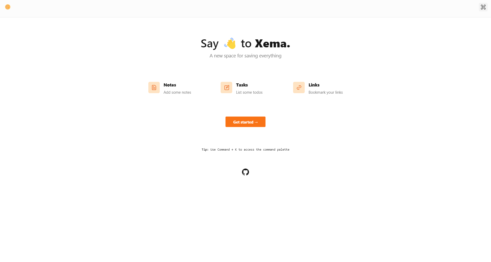

# Xema 📝🚀
A new space for everything ✅❤️🔥


## About

Xema is a place for everything. It's something I built so I can save bookmarks, lists, tasks, and anything really, for easy access. The minimal design I borrowed from a few people makes it look super cool. Please consider dropping a like, and follow me on github also 👍

#### Why  I built this:

- I wanted something fancy for my portfolio, again 🤩
- I wanted to know try out supabase
- I just love TailwindCSS

If you got any questions, just hit me up:

- Twitter [@hunchodotdev](https://twitter.com/hunchodotdev)
- Discord username [FatKidOnFiree#1355](FatKidOnFiree#1355) Add me as a friend ❤️
- Email [hunchodotdev@gmail.com](mailto:hunchodotdev@gmail.com)
- Email again [wartywarthog7@gmail.com](wartywarthog7@gmail.com)
- Telegram [FatKidOnFiree](https://t.me/FatKidOnFiree)
- Reddit username [yrn_quavo](yrn_quavo)

Nova was created with [React](https://reactjs.org) and [Supabase](https://supabase.io).


## Reviews

Nothing here yet 😔😭


## Installation and development

This app runs by default on port `3000`. 


```bash
git clone git@github.com:lucky-chap/xema
cd xema
npm i
```

#### After doing the above:

- Log in to your supabase [dashboard](https://app.supabase.io)
- Create a new project
- Now after it has been created, create a new table called `entries`
- Add new columns in the table:
    - `id` : string - non-nullable
    - `category` : string - non-nullable
    - `inserted_at` : string - non-nullable
    - `user_id` : string - non-nullable
    - `content` : string - nullable
    - `is_complete` : bool - nullable
- Now go to the authentication section of the supabase dashboard
- In development mode:
    - Set `Site URL` to the `http://localhost:3000`
- In production mode:
    - Set `Site URL` to the deployed URL of the project ([Vercel](https://vercel.com) is recommended)
    - Add the deployed URL of the project to the  `Addition Redirects` section, by separating with commas
- Finally, make sure you create a `.env.local` similar to [.env.example](.env.example)

#### After doing the above:
Run the following command

```bash
npm start
```

Voila! Open your browser to [localhost:3000](http://localhost:3000) to see the app running live 👍

## Contributing

⚠️ As of now, I have not provided a guide on contribution yet, but I'm working on that


## Author

- [Quavo](https://www.github.com/lucky-chap)

## License

This project is open source and available under the [MIT License](./LICENSE.txt).
